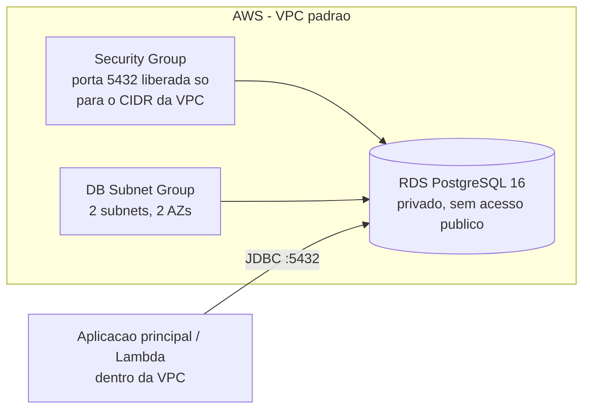
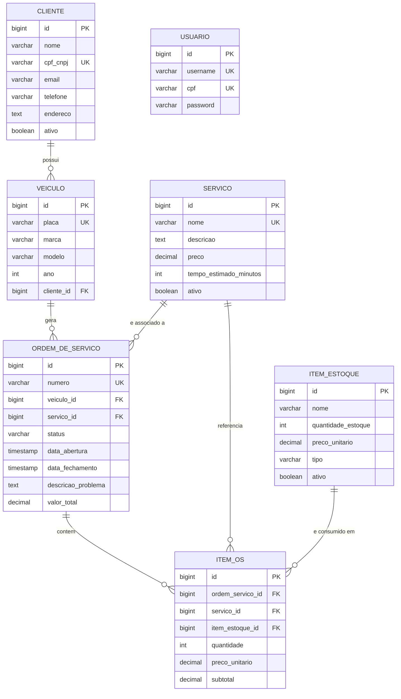

# Infraestrutura de Banco de Dados — Oficina FIAP (Fase 3)

## Descrição

Este repositório provisiona, via Terraform, o banco de dados gerenciado (Amazon RDS PostgreSQL) utilizado pela aplicação principal do Tech Challenge Fase 3.

## Tecnologias utilizadas

- Terraform (>= 1.5)
- Amazon RDS (PostgreSQL 16)
- GitHub Actions (CI/CD)
- Backend remoto S3 para o state do Terraform

## Arquitetura



A justificativa completa da escolha do PostgreSQL/RDS (incluindo alternativas consideradas) está no [ADR-002](https://github.com/pisanohub/oficina_fiap/blob/main/documentacao/decisoes/ADR-002-postgresql-rds.md), no repositório `oficina_fiap`.

## Diagrama Entidade-Relacionamento (DER)



### Explicação dos relacionamentos

- **Cliente → Veículo (1:N)**: um cliente pode ter vários veículos cadastrados; cada veículo pertence a um único cliente.
- **Veículo → Ordem de Serviço (1:N)**: cada ordem de serviço é aberta para um veículo específico; um veículo pode ter várias ordens ao longo do tempo.
- **Serviço → Ordem de Serviço (1:N, opcional)**: uma ordem de serviço pode estar associada a um serviço principal (campo opcional, preenchido quando o diagnóstico já identifica o tipo de serviço).
- **Ordem de Serviço → Item OS (1:N)**: cada ordem de serviço é composta por vários itens (mão de obra e/ou peças).
- **Serviço → Item OS (1:N)** e **Item de Estoque → Item OS (1:N)**: cada item de uma ordem de serviço referencia o serviço executado e, quando aplicável, a peça retirada do estoque.
- **Usuário**: tabela independente, sem relacionamento com as demais — armazena as credenciais dos funcionários (autenticação administrativa via login/senha), separada do cadastro de clientes (que se autenticam por CPF via Lambda).

## Passos para execução e deploy

### Pré-requisitos

- Conta AWS Academy Learner Lab ativa
- Terraform >= 1.5

### Execução local

```bash
terraform init
terraform plan
terraform apply
```

Variável necessária: `db_password` (via `TF_VAR_db_password`, sensível — nunca commitada).

### CI/CD

O pipeline (`.github/workflows/terraform.yml`) roda automaticamente:

- `terraform plan` em todo push/PR para a `main`
- `terraform apply` automático após merge na `main`
- Pode também ser disparado manualmente via `workflow_dispatch`
- Exibe o endpoint do banco (`terraform output`) diretamente no log do pipeline

A branch `main` é protegida: exige Pull Request e o check `terraform` com sucesso antes de qualquer merge.

## Observações

- O RDS **não** é encerrado automaticamente entre sessões do AWS Academy (diferente do cluster Kubernetes) — mas ainda depende de uma sessão ativa para ser gerenciado via Terraform.
- O banco não é publicamente acessível; só aceita conexões vindas de dentro da própria VPC (aplicação principal e Lambda de autenticação).
